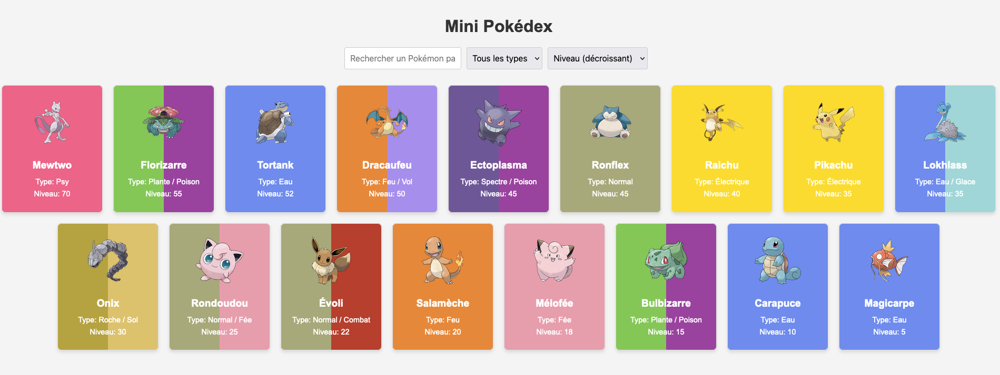
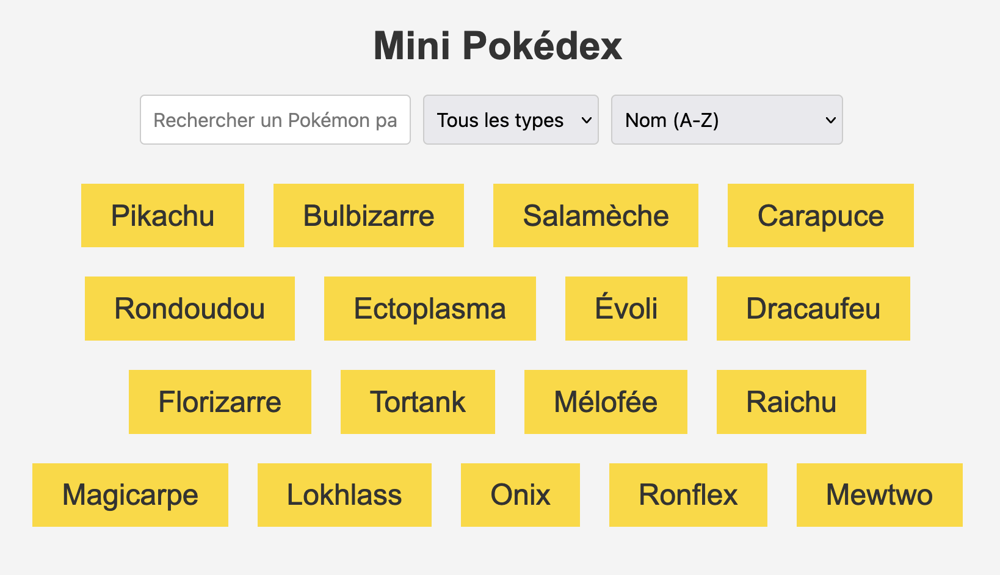
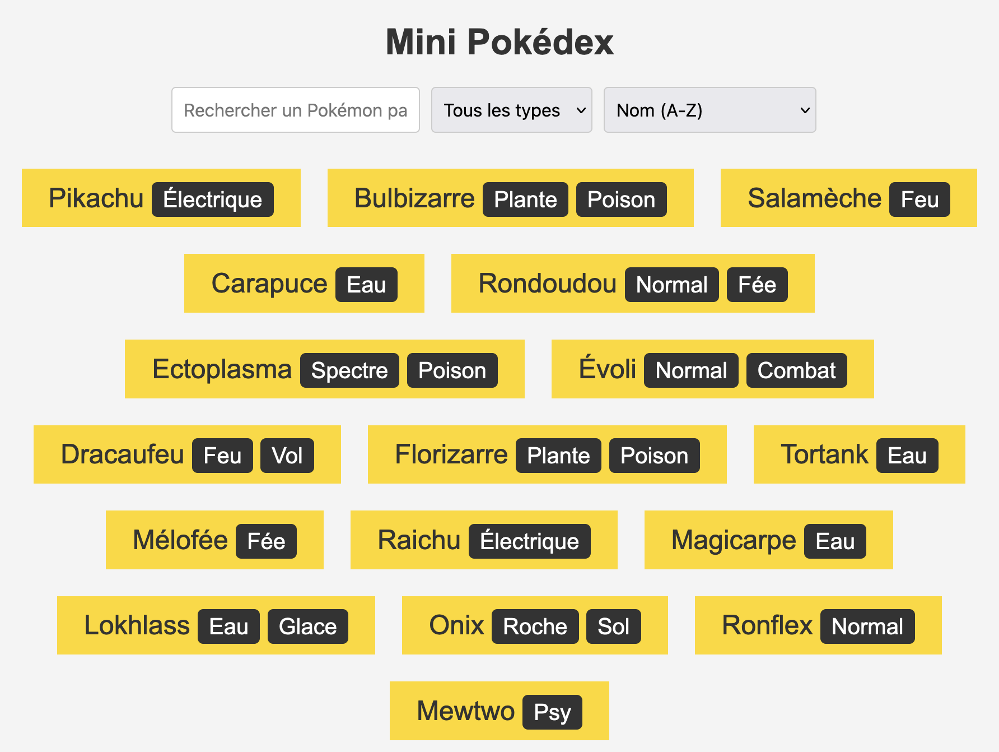
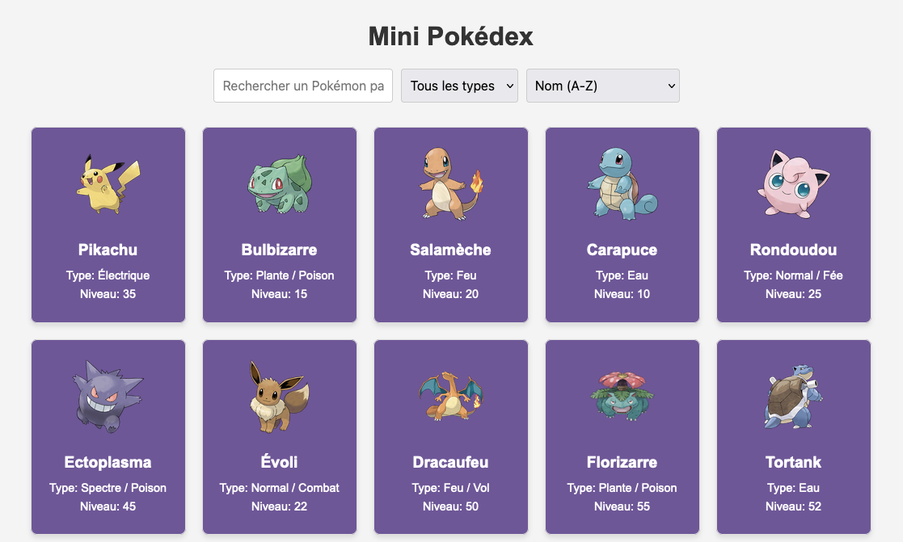
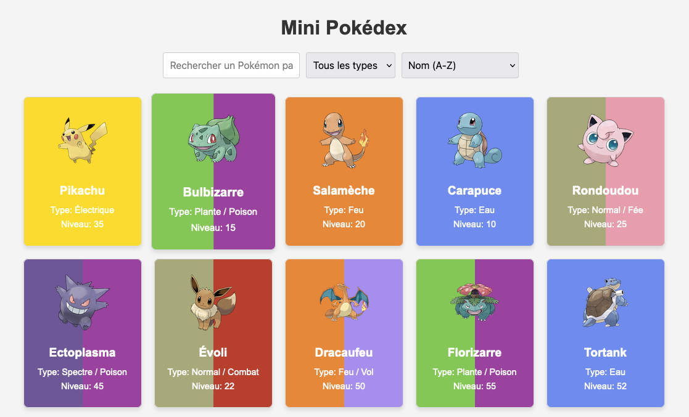
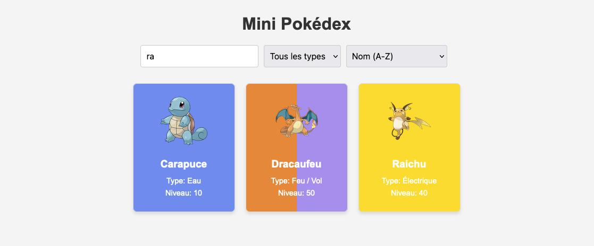
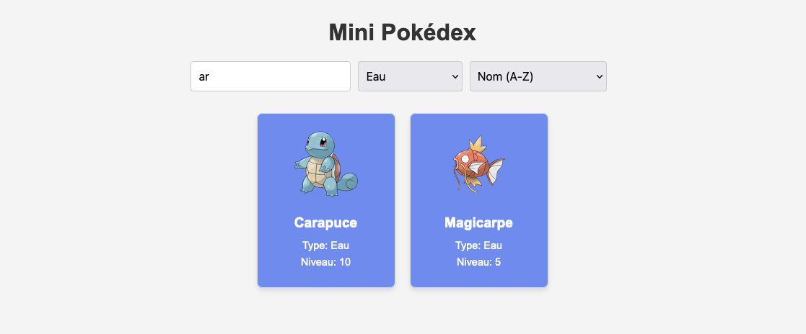
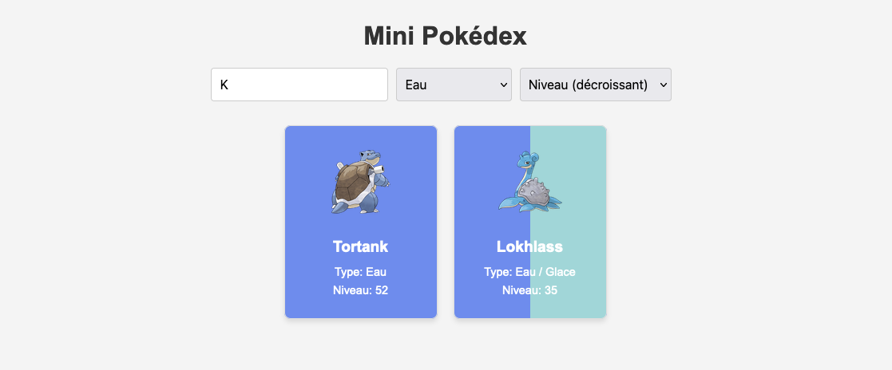

# 📒 Exercice Mini Pokédex

<div data-full-width="true">

<figure><figcaption></figcaption></figure>

</div>

## **Objectifs**

* **Manipuler le DOM :** Apprendre à utiliser JavaScript pour ajouter et modifier des éléments HTML sur une page.
* **Utiliser des Boucles :** Savoir parcourir un tableau pour afficher les éléments qu'il contient.
* **Gérer les Événements :** Comprendre comment réagir aux actions de l'utilisateur, comme la recherche ou le filtrage.
* **Travailler avec des Tableaux :** Utiliser des méthodes comme `filter()` et `sort()` pour filtrer et trier les données.
* **Appliquer des Styles Dynamiques :** Apprendre à changer l'apparence des éléments en fonction de leur contenu.
* **Construire une Interface Interactive :** Créer une interface qui s'adapte aux entrées de l'utilisateur, comme le tri et la recherche.
* **Valider les Données :** Vérifier que les données sont correctes avant de les afficher.
* **Utiliser la Documentation :** Encourager l'utilisation de la documentation pour résoudre des problèmes et apprendre de nouvelles fonctionnalités.

***

## Instructions

Pour réaliser cet exercice, copier les fichiers de ce dépôt


### Étape 1 : Afficher une liste simple de Pokémon

**Objectif :** Afficher une liste simple contenant les noms de tous les Pokémon.

<div data-full-width="true">

<figure><figcaption><p>Exemple de résultat pour la liste des noms des Pokémons</p></figcaption></figure>

</div>

#### **Instructions**

1. Dans le fichier `script.js`, ajoute créer une [fonction](../javascript/introduction/fonctions.md#creer-et-appeler-un-fonction) `displayPokemons` qui remplace le contenu du conteneur `.pokemon-container` par une liste des noms de Pokémon.
2. Utilise une [boucle](../javascript/introduction/boucles.md) pour parcourir le [tableau](../javascript/introduction/tableaux.md) `pokemons` et pour chaque Pokémon, crée un élément `<p>` contenant son nom.
3. Ajoute chaque nom de Pokémon avec [`innerHTML`](../javascript/dom-introduction/dom-modifier-texte.md#innerhtml).
4. Pensez à vider, réinitialiser, le contenu du conteneur `.pokemon-container` avant de créer la liste.
5. Utiliser les [_template literals_](../javascript/introduction/string.md#template-literals-litteraux-de-gabarits) pour créer des chaines de caractères dynamiques.
6.  Si le tableau des Pokémons est vide, ajouter le paragraphe suivant dans le conteneur `.pokemon-container`

    ```
    <p>Dracaufeu a tout brûlé, aucun Pokémon ne correspond à ta recherche !</p>
    ```
7. Pensez à appeler votre fonction pour la tester :smile:

#### **Exemple de résultat attendu**

La page doit simplement afficher les noms de Pokémon comme suit :

```html
<div class="pokemon-container">
    <p>Pikachu</p>
    <p>Bulbizarre</p>
    <p>Salamèche</p>
    <p>Carapuce</p>
    <p>Rondoudou</p>
    <!-- Les autres Pokémon -->
</div>
```

#### **Ressources utiles**

* [#creer-et-appeler-un-fonction](../javascript/introduction/fonctions.md#creer-et-appeler-un-fonction "mention")
* [#instruction-for...of](../javascript/introduction/tableaux.md#instruction-for...of "mention")
* [#template-literals-litteraux-de-gabarits](../javascript/introduction/string.md#template-literals-litteraux-de-gabarits "mention")
* [#innerhtml](../javascript/dom-introduction/dom-modifier-texte.md#innerhtml "mention")

***

### Étape 2 : Afficher une liste de Pokémon avec leur type

**Objectif :** Afficher les noms des Pokémon avec leurs types respectifs.

<div data-full-width="true">

<figure><figcaption><p>La liste des Pokémons avec leur <strong>nom</strong> et leur <strong>type.</strong></p></figcaption></figure>

</div>

#### **Instructions**

1. Modifie la fonction `displayPokemons` pour afficher le nom de chaque Pokémon, et son type.
2.  Pour chaque Pokémon, affiche son nom suivi de ses types dans un élément `<small>,` en n'oubliant pas les espaces s'il y a plusieurs types.

    ```html
    <p>Bulbizarre <small>Plante</small> <small>Poison</small></p>
    ```
3. Utilise la méthode `split()` pour convertir la chaine de caractères des types d'un Pokémon en tableau.


Un Pokémon possède au **minimum un type** et au **maximum deux**.


#### **Exemple de résultat attendu**

La page doit afficher la liste des Pokémon avec leurs types :

```html
<div class="pokemon-container">
    <p>Pikachu <small>Électrique</small></p>
    <p>Bulbizarre <small>Plante</small> <small>Poison</small></p>
    <p>Salamèche <small>Feu</small></p>
    <p>Carapuce <small>Eau</small></p>
    <p>Rondoudou <small>Normal</small> <small>Fée</small></p>
    <!-- Les autres Pokémon -->
</div>
```

**Ressources utiles :**

* [#extraire-des-chaines-slice-substring-et-split](../javascript/introduction/string.md#extraire-des-chaines-slice-substring-et-split "mention")

***

### Étape 3 : Créer des cartes de Pokémon

**Objectif :** Afficher chaque Pokémon sous forme de carte avec son nom, type, niveau, et image.

<div data-full-width="true">

<figure><figcaption><p>Exemple de solution pour l'étape 3</p></figcaption></figure>

</div>

#### **Instructions**

1. Créer une fonction `generatePokemonCardHTML(pokemon)` qui retourne le code HTML de la carte Pokémon pour l'objet Pokémon passé en paramètre.&#x20;
2. Le code HTML retourné par `generatePokemonCardHTML` remplacera chaque élément `<p>` dans la fonction `displayPokemons`
3.  Chaque carte doit inclure l'image du Pokémon, son nom, ses types et son niveau.

    Les images se trouvent dans le dossier `images/` du projet.
4. Utilise les [_template literals_](../javascript/introduction/string.md#template-literals-litteraux-de-gabarits) pour construire le HTML de chaque carte et le retourner.
5. Utiliser [`join()`](../javascript/introduction/tableaux.md#methode-join) pour fusionner les types et les séparer par une virgule et un espace  `,`&#x20;
6. Pense à appeler `generatePokemonCardHTML` dans `displayPokemons` à la place de la création du paragraphe `<p>`.

#### **Exemple de résultat attendu**

Chaque Pokémon est affiché dans une carte avec ses détails :

```html
<div class="pokemon-container">
    <div class="pokemon-card" style="background: #705898;">
        
        <h2>Pikachu</h2>
        <div>Type: Électrique</div>
        <div>Niveau: 35</div>
    </div>
    <div class="pokemon-card" style="background: #705898;">
        
        <h2>Bulbizarre</h2>
        <div>Type: Plante, Poison</div>
        <div>Niveau: 15</div>
    </div>
    <!-- Les autres Pokémon -->
</div>
```

#### **Ressources utiles**

* [#creer-et-appeler-un-fonction](../javascript/introduction/fonctions.md#creer-et-appeler-un-fonction "mention")
* [#template-literals-litteraux-de-gabarits](../javascript/introduction/string.md#template-literals-litteraux-de-gabarits "mention")
* [#methode-join](../javascript/introduction/tableaux.md#methode-join "mention")
* [#innerhtml](../javascript/dom-introduction/dom-modifier-texte.md#innerhtml "mention")

***

### Étape 4 : Couleurs de fond en fonction du type

**Objectif :** Appliquer une couleur de fond à chaque carte Pokémon par rapport à ses types.

<div data-full-width="true">

<figure><figcaption><p>Exemple de solution pour l'étape 4</p></figcaption></figure>

</div>

#### **Instructions**

1. Modifie la fonction pour que la couleur de fond de chaque carte soit déterminée par les types du Pokémon.
2.  Pour ajouter le _CSS_, on l'ajoutera en ligne **via la propriété** `style=""` de la `<div>` représentant la carte.

    <pre class="language-html"><code class="lang-html"><strong>&#x3C;div style="background: #FFD700;">
    </strong></code></pre>
3.  Si un Pokémon a deux types, utilise un dégradé de couleurs pour la carte.&#x20;

    ```html
    <div style="background: linear-gradient(to right, #78C850 50%, #A040A0 50%);">
    ```
4.  Utilise l'objet `typeColors` pour récupérer les couleurs associées à chaque type.

    ```javascript
    typeColors['Feu'] // Retoune le code couleur pour Feu soit '#F08030'
    ```
5. Utiliser [l'opérateur **ternaire**](../javascript/introduction/conditions.md#loperateur-conditionnel-ternaire) ou [opérateur de **coalescence**](../javascript/introduction/operateurs.md#loperateur-de-coalescence-or-or) pour affecter la couleur par défaut de la constante `DEFAULT_COLOR` au cas où le type n'existerait pas.

#### **Exemple de résultat attendu**&#x20;

Chaque carte Pokémon a un fond coloré correspondant à ses types :

```html
<div class="pokemon-container">
    <!-- Exemple de Pokemon avec un seul type -->
    <div class="pokemon-card" style="background: #FFD700;">
        
        <h2>Pikachu</h2>
        <div>Type: Électrique</div>
        <div>Niveau: 35</div>
    </div>
    
    <!-- Exemple de Pokemon avec deux types -->
    <div class="pokemon-card" style="background: linear-gradient(to right, #78C850 50%, #A040A0 50%);">
        
        <h2>Bulbizarre</h2>
        <div>Type: Plante, Poison</div>
        <div>Niveau: 15</div>
    </div>
    <!-- Les autres Pokémon -->
</div>
```

#### **Ressources utiles**

* [#extraire-des-chaines-slice-substring-et-split](../javascript/introduction/string.md#extraire-des-chaines-slice-substring-et-split "mention")
* [#loperateur-conditionnel-ternaire](../javascript/introduction/conditions.md#loperateur-conditionnel-ternaire "mention")
* [#loperateur-de-coalescence-or-or](../javascript/introduction/operateurs.md#loperateur-de-coalescence-or-or "mention")
* [#resume-de-la-creation-et-manipulation-dobjets](../javascript/introduction/objets.md#resume-de-la-creation-et-manipulation-dobjets "mention")
* [Documentation MDN sur les Dégradés CSS](https://developer.mozilla.org/fr/docs/Web/CSS/gradient)

***

### **Étape 5 : Recherche dans le nom des Pokémons**

**Objectif :** Crée une fonction qui filtre les Pokémon affichés en fonction des caractères saisi dans la barre de recherche.

<div data-full-width="true">

<figure><figcaption><p>Les Pokémon dont le nom contient <code>"ra"</code></p></figcaption></figure>

</div>

#### **Instructions**

1. Dans le fichier `script.js`, crée une nouvelle fonction `filterAndSortPokemons` qui va gérer le filtrage des Pokémon par nom :
   * Récupère la valeur du champ de recherche avec `searchBar.value.toLowerCase()`.
   * Utilise la méthode [`filter()`](../javascript/introduction/tableaux.md#filtrer-un-tableau) sur le tableau `pokemons` pour ne garder que les Pokémon dont le nom contient la chaîne de caractères entrée par l'utilisateur.
   * Appelle `displayPokemons(filteredPokemons)` pour afficher les Pokémon filtrés.
2. Ajoute un [gestionnaire qui écoute l'événement](../javascript/dom-introduction/evenements.md#addeventlistener) `input` sur la barre de recherche (`searchBar`) pour déclencher `filterAndSortPokemons` à chaque modification du texte.

#### **Tests manuels à effectuer :**

* Tape `Pika` dans la barre de recherche, et vérifie que seul Pikachu est affiché.
* Tape `a` dans la barre de recherche, et vérifie que tous les Pokémon contenant "a" dans leur nom sont affichés (par exemple, "Salamèche", "Bulbizarre").
* Tape `FFF` dans la barre de recherche, et vérifie que le message `Dracaufeu a tout brûlé, aucun Pokémon ne correspond à ta recherche !` s'affiche.
* Efface le texte dans la barre de recherche, et vérifie que tous les Pokémon sont de nouveau affichés.

#### **Ressources Utiles**

* [#addeventlistener](../javascript/dom-introduction/evenements.md#addeventlistener "mention")
* [#filtrer-un-tableau](../javascript/introduction/tableaux.md#filtrer-un-tableau "mention")

***

### **Étape 6 : Ajoute le Filtrage par Type dans `filterAndSortPokemons`**

**Objectif :** Mettre à jour la fonction `filterAndSortPokemons` pour inclure un filtre par type de Pokémon.

<div data-full-width="true">

<figure><figcaption><p>Les Pokémon de <strong>type Eau</strong> dont le nom contient  <code>"ar"</code> </p></figcaption></figure>

</div>

#### **Instructions**

1. Modifie la fonction `filterAndSortPokemons` pour ajouter un filtrage par type après le filtrage par nom :
   * Récupère la valeur du filtre de type avec `typeFilter.value`.
   * Si un type est sélectionné, utilise la méthode `filter()` pour ne garder que les Pokémon dont le type correspond à la sélection.
   * Appelle `displayPokemons(filteredPokemons)` pour afficher les Pokémon filtrés.
2. Ajoute un gestionnaire d'événement `change` à l'à la liste déroulante (`typeFilter`) pour déclencher `filterAndSortPokemons` à chaque changement de sélection.

#### **Tests manuels à effectuer :**

* Sélectionne `Feu` dans le filtre de type et vérifie que seuls les Pokémon de type Feu (comme Salamèche et Dracaufeu) sont affichés.
* Combine la recherche par nom et le filtre de type en tapant `a` dans la barre de recherche et en sélectionnant `Eau` comme type. Vérifie que seuls les Pokémon correspondant aux deux critères sont affichés (par exemple, Carapuce).
* Sélectionne `Tous les types` et vérifie que la recherche par nom fonctionne toujours correctement.

***

### **Étape 7 : Ajoute le Tri dans `filterAndSortPokemons`**

**Objectif :** Achever la fonction `filterAndSortPokemons` pour trier les Pokémon en fonction du critère sélectionné dans le menu déroulant de tri.

<div data-full-width="true">

<figure><figcaption><p>Pokémons triés <strong>par Niveau décroissant</strong>, de <strong>type Eau</strong> et contenant la lettre <code>"K"</code> dans leur nom</p></figcaption></figure>

</div>

#### **Instructions**

1. Modifie la fonction `filterAndSortPokemons` pour ajouter le tri après le filtrage par nom et par type :
   * Récupère la valeur du critère de tri avec `sortOrder.value`.
   * Utilise la méthode [`sort()`](../javascript/introduction/tableaux.md#trier-un-tableau) pour trier les Pokémon selon le critère sélectionné : par nom (A-Z, Z-A) ou par niveau (croissant, décroissant).
   * Appelle `displayPokemons(filteredPokemons)` pour afficher les Pokémon triés.
2. Ajoute un gestionnaire d'événement `change` au critère de tri (`sortOrder`) pour déclencher `filterAndSortPokemons` à chaque changement de sélection.

#### **Tests manuels à effectuer**

* Sélectionne : `Nom (A-Z)` et vérifie que les Pokémon sont affichés par ordre alphabétique croissant.
* Sélectionne : `Nom (Z-A)` et vérifie que les Pokémon sont affichés par ordre alphabétique décroissant.
* Sélectionne : `Niveau (croissant)` et vérifie que les Pokémon sont affichés par ordre de niveau croissant.
* Sélectionne : `Niveau (décroissant)` et vérifie que les Pokémon sont affichés par ordre de niveau décroissant.
* Combine les filtres de type, la recherche par nom et le tri pour vérifier que tout fonctionne ensemble correctement (par exemple, tape `a`, sélectionne `Eau` comme type, et trie par `niveau décroissant`).

#### **Ressources Utiles**

* [#trier-un-tableau](../javascript/introduction/tableaux.md#trier-un-tableau "mention")
* [#extraire-des-chaines-slice-substring-et-split](../javascript/introduction/string.md#extraire-des-chaines-slice-substring-et-split "mention")

## **Challenges supplémentaires**

### **Ajouter une Pagination**

* **Objectif :** Implémenter un système de pagination pour diviser l'affichage des Pokémon en plusieurs pages.
* **Instructions :** Limiter le nombre de Pokémon affichés par page (par exemple 6), et ajouter des boutons "Suivant" et "Précédent" pour naviguer entre les pages.

### **Favoris et Filtrage Avancé**

* **Objectif :** Permettre à l'utilisateur de marquer certains Pokémon comme favoris et d'ajouter un filtre pour n'afficher que les favoris.
* **Instructions :** Ajouter un bouton "Favori" sur chaque carte Pokémon, stocker l'état des favoris dans `localStorage`, et ajouter un filtre pour n'afficher que les Pokémon marqués comme favoris.

### **Animer l'Affichage des Cartes**

* **Objectif :** Ajouter des animations pour améliorer l'affichage des cartes Pokémon, à l'affichage ou au passage par-dessus ou au clic.
* **Instructions :** Ajouter un effet de fondu ou de glissement lors de l'apparition des cartes, et utiliser des transitions CSS pour des changements de couleur ou d'apparence.


## :dodo: La solution du prof


Le site du prof



Le code du prof

