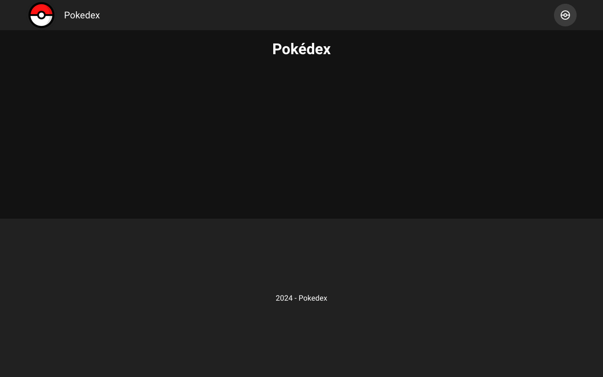

# 📒 Exercice Pokédex Vuetify

## Introduction

Cet exercice consiste à créer une application Pokédex avec **Vue.js** et **Vuetify**. Vous allez apprendre à construire une interface utilisateur interactive avec des composants **Vuetify**, à gérer l'état de l'application avec **Pinia**, et à intégrer des fonctionnalités telles que la recherche et la gestion des favoris pour les Pokémon.

L'application finale inclura les fonctionnalités suivantes :

* **Liste des Pokémon avec recherche** : une page permettant de visualiser une liste détaillée des Pokémon disponibles avec un champ de recherche permettant de trouver des Pokémon par leur nom.
* **Gestion des favoris** : Possibilité d'ajouter des Pokémon à une liste de favoris, avec stockage local pour les conserver entre les sessions.
* **Affichage détaillé** : une page dédiée à chaque Pokémon avec ses informations détaillées.
* **FAQ** : Une page avec quelques FAQ sur les Pokémons.
* **Monde Pokémon :** une page simple présentant une carte du monde Pokémon, avec quelques textes.

Voici un exemple de solution : [https://kode.ch/pokedex/](https://kode.ch/pokedex/)

## Mise en place

1. **Cloner le dépôt de l'exercice** et l'ouvrir dans WebStorm.
2.  **Installer les dépendances** : ouvrez un terminal à la racine du projet et exécutez la commande suivante pour installer toutes les dépendances nécessaires :

    ```sh
    npm install
    ```
3.  **Lancer le serveur de développement** : une fois les dépendances installées, lancez le serveur de développement avec la commande :

    ```sh
    npm run serve
    ```
4. **Accéder à l'application dans le navigateur** : après avoir démarré le serveur, vous verrez une URL (généralement `http://localhost:3000`) dans le terminal. Ouvrez cette URL dans votre navigateur pour afficher l'application de départ.

Vous devriez apercevoir le résultat suivant :

<figure><figcaption></figcaption></figure>

## Présentation du projet de départ

### Structure du projet

Voici une vue d'ensemble des différents dossiers et fichiers du projet :

* **public/** : Contient le fichier `index.html`, qui est le point d'entrée statique de l'application.
  * **images/** : Contient les **images des Pokémons**
* **src/** : Le dossier principal qui contient tout le code source de l'application
  * **assets/** : Contient les ressources statiques comme les images, les icônes, le **logo du site**, etc.
  * **components/** : Contient les composants Vue réutilisables de l'application. C'est ici que vous pourrez créer vos composants.
  * **pages/** : Contient les différentes vues (ou pages) de l'application. Voici les fichiers présents dans le code de départ :
    * **index.vue** : Page principale du projet.
    * **\[...path].vue** : Page chargé lorsque la route est incorrecte, souvent utilisé pour afficher une page "404 - Non trouvée".
  * **stores/** : Contient la configuration initiale du magasin Pinia pour la gestion de l'état global de l'application.
    * **pokemons.js** : Fichier qui gère l'état des données des Pokémon, incluant leur liste, leurs détails, et les actions associées.
  * **App.vue** : Composant racine de l'application
  * **main.js** : Point d'entrée JavaScript de l'application appelé par index.html. Il initialise Vue, intègre Vuetify, Pinia, et Vue Router.

### Affichage (layout) de base

Le composant principal **App.vue** est composé de trois sections principales :

* **\<app-header>** : Charge le composant `components/AppHeader.vue` qui contient l'entête du site (logo et menu de navigation).
* **\<v-main>** : Contenu principal de la page qui contient le composant `<router-view>`, qui affiche dynamiquement les pages en fonction de la route active.
* **\<v-footer>** : Pied de page du site contenant un simple copyright

## Travail à réaliser

### **Étape 1 - Créer les pages**

Créer les quatre pages avec comme contenu un unique titre principal `<h1>`.&#x20;

Voici le nom des fichiers et les titres à utiliser pour ces pages à créer dans le dossier `src/pages/` de l'application.

* `index.vue` - `Pokédex : page d'accueil`
* `Favoris.vue` - `Mes Pokémons Favoris`
* `FAQ.vue` - `Foire Aux Questions (FAQ)`
* `KantoMap.vue` - `Monde Pokémon`

#### Tester les pages

Les **routes** (url) sont **automatiquement créées** en fonction du nom des fichiers contenus dans le dossier `src/pages/` de l'application.

Assurez-vous que vos pages sont bien accessibles :&#x20;

* `index.vue` - [http://localhost:3000/](http://localhost:3000/)
* `Favoris.vue` - [http://localhost:3000/favoris](http://localhost:3000/favoris)
* `FAQ.vue` - [http://localhost:3000/faq](http://localhost:3000/faq)
* `KantoMap.vue` - [http://localhost:3000/kantomap](http://localhost:3000/kantomap)

### **Étape 2 - Créer** les liens du menu de navigation

Le menu de navigation est implémenté dans le composant `AppHeader.vue`, qui est inclus dans le composant principal `App.vue`.&#x20;


```markup
<template>
  <v-app-bar flat>
    <v-container class="d-flex align-start align-center">
      <v-avatar
        class="mr-4 pa-0 cursor-pointer"
        image="@/assets/pokeball.svg"
        size="64"
        @click="$router.push('/')"
      />
      <v-toolbar-title>Pokedex</v-toolbar-title>
      <v-btn
        v-for="link in menuItems"
        :key="link.title"
        :icon="link.icon"
        :to="link.path"
      />
    </v-container>
  </v-app-bar>
</template>

<script setup>
  const menuItems = [
    { title: 'Accueil', path: '/', icon: 'mdi-pokeball' },
    // Ajouter ici les autres liens du menu.
    // Vous trouverez des icônes sur https://pictogrammers.com/library/mdi/
    // N'oubliez pas d'ajouter le préfixe 'mdi-' devant le nom de l'icône.
  ]
</script>
```



Ce menu utilise le composant `v-app-bar` de Vuetify pour créer une barre de navigation en haut de la page. Voici les éléments principaux du code :

* `v-avatar` : Affiche un avatar représentant une Pokéball qui, lorsqu'on clique dessus, redirige vers la page d'accueil.
* `v-toolbar-title` : Affiche le titre "Pokédex".
* `v-btn` : La directive `v-for` crée un bouton de navigation pour chaque élément du tableau `menuItems` défini dans le `<script>` du composant.

Dans le code de départ, il n'y a qu'un seul élément nommé "Accueil" avec une icône de Pokéball.

Pour ajouter un lien au menu, il suffit d'ajouter un élément au tableau `menuItems`.

#### Trouver et utiliser des icônes

Ce projet utilise les _Material Design Icons._ Pour utiliser l'une de ces icônes, il suffit d'utiliser le préfixe `mdi-` suivi du nom de l'icône. Par exemple, l'icône nommée `account` devient `mdi-account.`

Vous trouverez la liste des icônes sur ce site :&#x20;



### **Étape 3 - Créer le contenu de la page "**Le Monde Pokémon**"**

#### Image

Ajouter l'image du monde Pokémon qui se trouve dans `public/images/pokemon-map.png` en utilisant un composant `v-img.`  Utiliser la valeur suivante pour la source de l'image dans le code du template HTML  `src="/images/pokemon-map.png"`.


Documentation du composant Image de Vuetify


#### Texte

Ajouter le texte ci-après dans un composant `v-card.`


Documentation du composant Card de Vuetify


```markup
<h2>Un univers fascinant à découvrir</h2>
<p>Le monde Pokémon est un vaste et merveilleux univers peuplé de créatures extraordinaires appelées Pokémon. Cette carte représente les différentes régions que les dresseurs peuvent explorer, chacune offrant ses propres défis, Pokémon uniques et aventures palpitantes.</p>

<h2>Des régions diversifiées</h2>
<p>De Kanto à Galar, en passant par Johto, Hoenn, Sinnoh, Unova, Kalos et Alola, chaque région du monde Pokémon possède sa propre identité, sa culture et son écosystème unique. Les paysages varient des montagnes enneigées aux îles tropicales, offrant une diversité incroyable d'habitats pour les différentes espèces de Pokémon.</p>

<h2>Un monde en constante évolution</h2>
<p>Le monde Pokémon est en perpétuelle expansion, avec de nouvelles régions, de nouvelles espèces de Pokémon et de nouvelles aventures qui sont régulièrement découvertes. Cette carte n'est qu'un aperçu d'un univers riche et en constante évolution, prêt à être exploré par les dresseurs audacieux.</p>

<h2>Un appel à l'aventure</h2>
<p>Que vous soyez un dresseur débutant ou expérimenté, le monde Pokémon vous invite à partir à l'aventure. Capturez de nouveaux Pokémon, affrontez des champions d'arènes, déjouez les plans des équipes malveillantes et devenez peut-être le prochain Maître Pokémon. L'aventure commence ici, sur cette carte, mais où vous mènera-t-elle ?</p>
```

#### Popup pour l'image

Faire en sorte que l'image s'affiche dans une boite de dialogue lorsqu'on clique dessus en utilisant le composant `v-dialog`.&#x20;


Explorer les codes des différentes démos de la documentation Vuetify pour trouver l'exemple qui ressemble le plus à votre objectif.



Documentation du composant Dialog de Vuetify


### **Étape 4 - Créer le contenu de la page "Vos questions"**

Utiliser un composant Vuetify approprié, hé oui c'est à vous de trouver 😜, pour réaliser une page de FAQ. Les questions doivent être listées et afficher leur réponse au clic.


La liste de tous les composants Vuetify


### **Étape 5 - Créer le contenu de la page "Pokédex"**

#### Objectifs :&#x20;

* [ ] Récupérer le magasin Pina des Pokémons et ses données
* [ ] Parcourir le tableau des Pokémons et afficher au minimum les données suivantes&#x20;
  * Nom
  * Image. Elles sont dans `public/images/`  comme pour la carte du monde.
  * Type
  * Niveau
* [ ] Mettre en couleur les types

Pour créer cette page, vous aurez besoin d'accéder au magasin Pinia des Pokémons qui se trouve dans `src/stores/pokemonStore.js`. C'est dans ce magasin que sont stockés tous les Pokémons.

#### Introduction au magasin Pinia

Pinia est un **gestionnaire d'état** pour Vue.js qui vous permet de centraliser l'**état des données** de votre application de manière propre et efficace.

Dans cet exemple, nous avons un magasin Pinia appelé **`pokemon`** qui contient une liste de différents Pokémon, chacun avec des informations comme le type, le niveau, les capacités, etc. Nous allons voir comment ce magasin est structuré, ainsi que les différentes fonctionnalités qu'il offre.

#### Contenu du Magasin

Le magasin se compose de trois sections principales :&#x20;

* L'état (state) → Les données
* Les getters → Les données calculées → computed
* Les actions → Les méthodes utilisées pour modifier l'état, les données

**État (state)**

L'état est la partie du magasin qui contient **les données** que nous voulons partager dans notre application. Dans cet exemple, l'état comprend :

* **`typeColors`** : un objet associant à chaque type de Pokémon une couleur
* **`pokemons`** : un tableau d'objets représentant chaque Pokémon, chacun avec des caractéristiques comme le nom, le type, le niveau, les capacités et des statistiques (PV, attaque, défense, etc.).
* **`selectedPokemon`** : permet de garder une référence au Pokémon sélectionné par l'utilisateur.
* **`favorites`** : un tableau des Pokémon favoris sélectionnés par l'utilisateur.

**Getters**

Les getters ressemblent aux propriétés calculées pour votre état. Ils permettent de dériver des données  établies sur l'état existant. Par exemple :

* **`favoritesCount`** : ce getter renvoie le nombre de Pokémon ajoutés aux favoris.

**Actions**

Les actions sont utilisées pour modifier l'état. Elles sont comparables aux méthodes dans une classe ou un composant. Voici les actions définies dans notre magasin :

* **`selectPokemon(id)`** : permet de sélectionner un Pokémon à partir de son identifiant. Cela met à jour la propriété `selectedPokemon`.
* **`toggleFavorite(pokemon)`** : ajoute ou de retire un Pokémon de la liste des favoris.
* **`isFavorite(pokemon)`** : renvoie `true` si le Pokémon est dans les favoris, sinon `false`.
* **`getTypeColor(type)`** : renvoie la couleur associée à un type de Pokémon. Si le type n'existe pas, une couleur par défaut est renvoyée.

#### Utilisation du magasin dans un composant

Voyons maintenant comment utiliser ce magasin Pinia dans un composant.

**Importer le magasin**

Pour utiliser le magasin, nous devons d'abord l'importer dans notre composant :

```markup
<script setup>
import { usePokemonStore } from '@/stores/pokemon'
import { storeToRefs } from 'pinia'

// Récupère le magasin des Pokémons
const pokemonStore = usePokemonStore()

/* Récupère les données pokemons, selectedPokemon, favorites
 * et les transforme directement en refs (données réactives) dans le composant
 *
 * Elles sont donc directement accessibles dans le template HTML
 *
 * Attention à ne pas oublier le .value dans le <script> pour accéder à la valeur 
 * comme pour les autre refs.
 */
const { pokemons, selectedPokemon, favorites } = storeToRefs(pokemonStore)

// Fonction pour sélectionner un Pokémon
function selectPokemon(id) {
  pokemonStore.selectPokemon(id)
}

// Fonction pour basculer un Pokémon en favori
function toggleFavorite(pokemon) {
  pokemonStore.toggleFavorite(pokemon)
}

// Fonction pour obtenir le nombre total de Pokémon
function getTotalPokemons() {
  // On utilise .value pour récupérer la valeur
  return pokemons.value.length;
}
</script>
```

* **`usePokemonStore()`** : Cette fonction nous permet d'accéder au magasin.
* **`storeToRefs(pokemonStore)`** : Cette méthode est utilisée pour convertir les propriétés réactives du magasin en références réactives, ce qui facilite leur utilisation dans le template.
* **`selectPokemon()`** et **`toggleFavorite()`** : ces méthodes sont définies localement en appelant les actions du magasin.
* **`getTotalPokemons()`** : méthode locale qui retourne la taille du tableau des Pokémons.

**Utilisation dans le Template**

Voici un exemple de la façon dont vous pouvez utiliser l'état, les getters et les actions dans le template :

```html
<template>
  <div>
    <h1>Liste des Pokémon</h1>
    <ul>
      <li v-for="pokemon in pokemons" :key="pokemon.id">
        
        <h2>{{ pokemon.name }}</h2>
        <p>Type : <span :style="{ color: getTypeColor(pokemon.type) }">{{ pokemon.type }}</span></p>
        <button @click="selectPokemon(pokemon.id)">Voir les détails</button>
        <button @click="toggleFavorite(pokemon)">
          {{ isFavorite(pokemon) ? 'Retirer des favoris' : 'Ajouter aux favoris' }}
        </button>
      </li>
    </ul>
  </div>
</template>
```

* **`v-for="pokemon in pokemons"`** : Boucle sur la liste des Pokémon pour les afficher.
* **`getTypeColor(pokemon.type)`** : Utilise la couleur du type pour styliser le texte.
* **`selectPokemon(pokemon.id)`** : Action pour sélectionner un Pokémon spécifique.
* **`toggleFavorite(pokemon)`** : Action pour ajouter ou retirer un Pokémon des favoris.

### **Étape 6 - Créer le contenu de la page "Favoris"**

Afficher tous les Pokémon ajoutés en favori, en utilisant le stockage local (localStorage) pour conserver ces favoris en complément du store Vuex.

### **Étape 7 - Créer la fiche de détail d'un Pokémon**


## :dodo: La solution du prof
