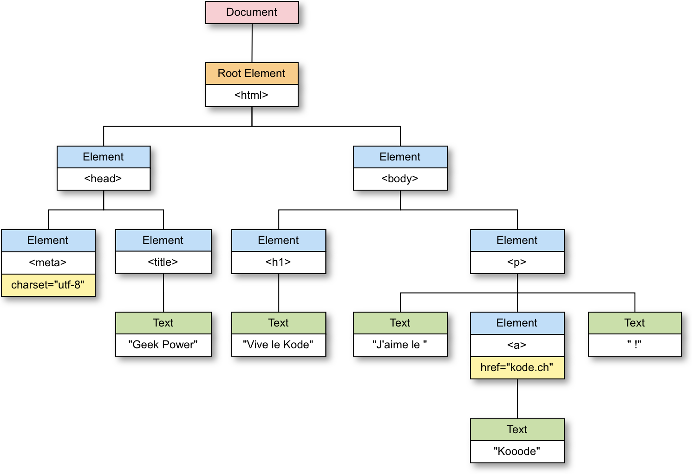

# Introduction

## Dis papa c'est quoi le DOM ?

Le DOM \(Document Object Model\) est un objet JavaScript représentant le document HTML \(ou XML\) actuellement chargé dans le navigateur.

Dans cet objet, le document `Document` y est **représenté comme un arbre nodal**, chaque nœud `Node` représentant une partie du document.

Il existe trois pricipaux type de nœud :

* `Element` : un élément HTML `<p>, <h1>, <body>, , ...`
* `Text` : chaine de caractères `"C'est pas faux !"`
* `Comment` : commenaire HTML `<!-- Je suis un simple commentaire -->`

### Exemple

Ci-après le code source d'un document HTML et sa repésentation sous forme d'arbre nodal de type DOM.

```markup
<!doctype html>
<html>
    <head>
        <meta charset="utf-8">
        <title>Geek Power</title>
    </head>

    <body>
        <h1>Vive le Kode</h1>
        <p>J'aime le <a href="http://www.kode.ch">Kooode</a> !</p>
    </body>
</html>
```



## Et JavaScript dant tou ça ?

Grâce au DOM, JavaScript à le pouvoir de :

* **Récupérer un élément** HTML du document `<h1>, <p>, <a>, …`
* **Naviguer entre les éléments** en récupérants ses élements fils, parents ou voisins \(frères\)
* **Modifier un élément** en changeant :
  * son **contenu texte** `"texte"` **ou HTML** `"<li>Yoda</li>"`
  * son **style CSS** `fontSize, backgroundColor, border, ...`
  * ses **attributs** `href, class, src, …`
  * ses **événements** `click, submit, mouseover, load, ...`
* **Créer un élément** et l'ajouter au document
* **Supprimer un élément** HTML du document

Ces manipulations sont présentées dans les chapitres suivants.

