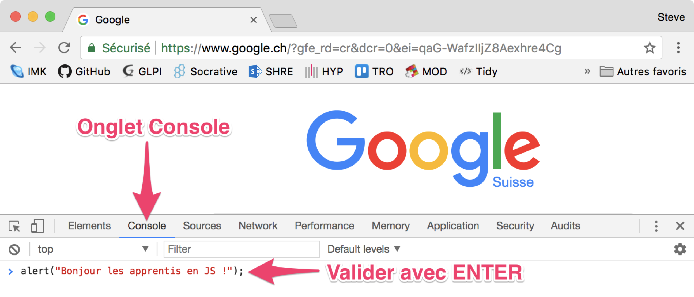

# Introduction

JavaScript est un **langage de script**, **multi-plateforme** et **orienté objet**.

C'est un **langage léger** qui **doit faire partie d'un environnement hôte** \(un navigateur web par exemple\) pour qu'il puisse être **utilisé sur les objets de cet environnement**.

Quelques généralités sur JavaScript :

* Langage interprété
  * Nécessite un interpréteur \(versus. un compilateur\)
* Langage orienté objet
  * Langage à « prototype »

    Un prototype est un objet à partir duquel on crée de nouveaux objets
* Sensible à la casse
* Confusion fréquente avec Java
  * Aucun lien entre ces 2 langages !
* Anciennement appelé ECMAScript
  * Standardisé par ECMA \( European Computer Manufacturers Association\)

## Ou écrire du JavaScript

### Dans la console d'un navigateur



1. Ouvrir la **console** de votre navigateur
2. `command` + `option` + `J` \(Mac\) ou `control` + `shift` + `J` \(Windows, Linux, Chrome OS\) pour ouvrir la **console**.
3. Sélectionner l'**onglet Console**.
4. Écrire l'instruction suivante : `alert("Bonjour les apprentis en JS");`
5. Valider l'instruction avec la touche `↵ Enter`

### Dans une fichier HTML

Il suffit de placer le code JavaScript dans un élément HTML `<script>`.

Le code JavaScript contenu dans les balises `<script>` est interprété instruction par instruction comme les éléments HTML.

```markup
<h1>Titre de ma page</h1>

<script>
    alert("Bonjour depuis une page HTML !");
</script>

<p>Un petit paragraphe</p>
```

> Bonne pratique : éviter de mélanger JavaScript et HTML.
>
> Un bon développeur séparera toujours le contenu \(HTML\), la mise en forme \(CSS\) et les traitements \(JavaScript\).

### Dans un fichier externe

Généralement on écrit le code JavaScript dans des fichiers portant l'extension `.js`. Exemple : `panier-achats.js`

Pour intégrer un fichier JavaScript dans un document HTML on utilisera l'élément `<script>` et l'attribut `src`. Exemple :

```markup
<script src="panier-achats.js"></script>
```

#### Ou placer la balise `<script>`

Il est fortement recommandé de placer ses scripts à la fin du document juste avant la balise de fermeture `</body>`.

```markup
<!DOCTYPE html>
<html lang="fr">
  <head>
    <title>Panier d'achats</title>
  </head>
  <body>
    <h1>Votre panier d'acahts</h1>
    <p>Cette semaine promotion sur les loutres blanches du Gabon</p>

    <!-- Inclusion des scipts -->  
    <script src="panier-achats.js"></script>
  </body>
</html>
```

> Mais pourquoi à la fin et pas au début du document, dans l'entête `<head>` ?

Le navigateur interprète le code de la page et résout les éléments un par un.

Lorsqu'il rencontre un élément `<script>` il va charger tout son contenu avant de passer à l’élément suivant.

L’inclusion des script à la fin du document va donc permettre :

* D’afficher plus rapidement quelque chose à l’écran. On ne devra pas attendre la fin du chargement des scripts avant d'interpréter le HTML.
* de manipuler les éléments HTML de la page car tous créés avant l'interprétation du script.

