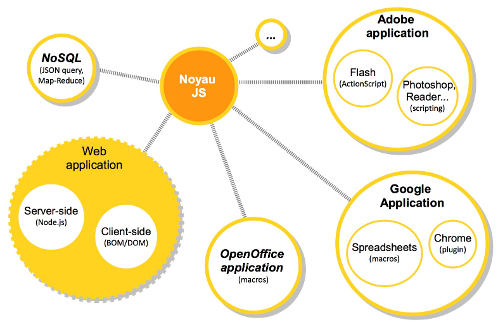
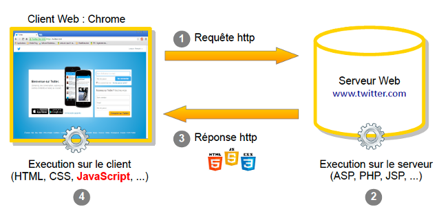
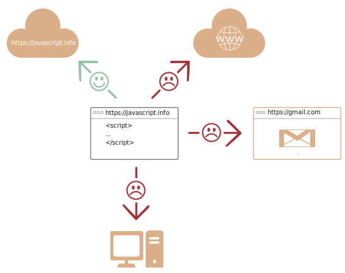
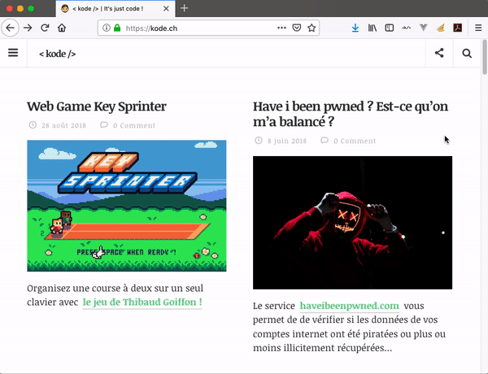
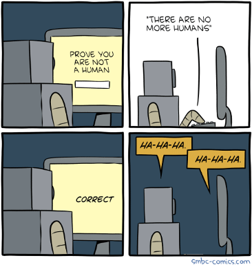

# Introduction à JavaScript

## Présentation

JavaScript est un **langage de script**, **multiplateforme** et **orienté objet**.

C'est un **langage léger** qui **doit faire partie d'un environnement hôte** (un navigateur web par exemple) pour qu'il puisse être **utilisé sur les objets de cet environnement**.

<div data-full-width="true">

<figure><figcaption><p>La galaxie JavaScript</p></figcaption></figure>

</div>

## Quelques généralités sur JavaScript :

* Langage **interprété**
  * Nécessite un interpréteur (versus. un compilateur)
* Langage **orienté objet**
  *   Langage à « prototype »

      Un prototype est un objet à partir duquel on crée de nouveaux objets
* **Sensible à la casse**
* **Confusion** fréquente **avec Java**
  * Anciennement appelé **LiveScript**, créé en 1995
  * Renommé JavaScript par **son père** **Brendan Eich** pour bénéficier de la popularité de Java dans les années 90.
* Anciennement appelé **ECMAScript** - ES
  * Standardisé par **ECMA** - European Computer Manufacturers Association
  * ES5 (2009) version la plus répandue / **ES6** (2014), prend de l’ampleur

## JavaScript une technologie "**CLIENT " (Navigateur)**

<div data-full-width="true">

<figure><figcaption></figcaption></figure>

</div>

### Pourquoi les technologies "CLIENT" sont-elles à la mode ?

Certains traitements, autrefois effectués uniquement sur le serveur, peuvent désormais être réalisés directement par le navigateur, grâce aux technologies client-side modernes.

Par exemple, la validation des formulaires ou la mise à jour dynamique de l'interface utilisateur se font instantanément, sans nécessiter une requête vers le serveur.

Cette tendance à se tourner vers les technologies client-side, telles que JavaScript et ses frameworks (React, Vue.js, Angular), s'explique par plusieurs facteurs :

* **Réduction de la charge serveur :** En déplaçant certains traitements vers le client, les serveurs sont moins sollicités, ce qui réduit les coûts d'infrastructure pour les fournisseurs comme Google ou Facebook.
* **Amélioration des performances et de l'expérience utilisateur :** Les traitements côté client permettent des interactions plus rapides et fluides, améliorant ainsi l'expérience utilisateur en réduisant le temps de latence.
* **Scalabilité accrue :** Moins dépendants du serveur pour les tâches simples, les applications peuvent gérer un plus grand nombre d'utilisateurs simultanément, ce qui est crucial pour des plateformes à grande échelle comme celles de Google ou Facebook.
* **Personnalisation et réactivité :** Les technologies client-side permettent une personnalisation plus poussée des interfaces et une réactivité immédiate aux actions des utilisateurs, créant ainsi des expériences plus engageantes et dynamiques.

En somme, l'adoption des technologies client-side répond à la fois à des besoins de performance, de coût, et d'évolutivité, tout en offrant aux utilisateurs une expérience plus riche et immersive.

### Que peut faire JavaScript dans le navigateur ?

* Ajouter du HTML, modifier du contenu, agir sur le style
* Réagir aux actions, clics, mouvements, pressions de touches
* Envoyer des requêtes réseaux, download, upload des fichiers
* Agir sur les cookies, afficher des messages
* Stocker des données côté client (« local storage »)

### Qu'est-ce que JavaScript ne peut pas faire dans le navigateur ?

* Accéder au disque (lecture ou écriture)
* Récupérer des fichiers sans l'accord de l'utilisateur
* Interagir avec la caméra et le micro sans autorisation
* Interagir avec les autres onglets et autres domaines

<figure><figcaption></figcaption></figure>

### **Chaque navigateur intègre un interpréteur de JS**

* **SpiderMonkey** (Firefox)
* **V8** (Google Chrome, Microsoft Edge)
* **JavaScriptCore** (Safari)
* **Chakra** (Internet Explorer)

### Qu'est-ce qui rend JavaScript unique ?

* Intégration complète avec HTML/CSS
* Supporté et activé par défaut par les principaux navigateurs
* Principal outil pour créer des interfaces utilisateurs
* Peut faire :
* Frontend (Vue.js, React, Angular)
* Backend (Node.js, Deno)
* Applications multiplateforme (Slack, Discord)
* Applications mobiles

### Les langages "par-dessus" JavaScript

* JavaScript tel quel ne convient pas à tout le monde
* Des surcouches à JavaScript ont été créées :
  * CoffeeScript (sucre syntaxique)\
    En d'autres termes, il s'agit de raccourcis syntaxiques qui simplifient l'écriture du code, le rendant plus "sucré" ou agréable, sans modifier le sens du programme.
  * TypeScript (typage strict - Microsoft)
  * Flow (typage strict - Facebook)
  * Dart (langage orienté apps - Google pour le mobile)

### Résumé

* JavaScript a été créé pour le navigateur au départ
* Aujourd'hui utilisé dans de nombreux environnements
* Langage parmi les plus populaires au monde
* Intégration complète avec HTML/CSS (la sainte trinité du web)
* Il existe d'autres langages qui sont « **transpilés** » en JavaScript

## Où écrire du JavaScript

#### Dans la console d'un navigateur



1. Ouvrir la **console** de votre navigateur `command` + `option` + `J` (Mac) ou `control` + `shift` + `J` (Windows, Linux, Chrome OS) pour ouvrir la **console**.
2. Sélectionner l'**onglet Console**.
3. Écrire l'instruction suivante : `alert("Bonjour les apprentis en JS");`
4. Valider l'instruction avec la touche `↵ Enter`

### Dans un fichier HTML

Il suffit de placer le code JavaScript dans un élément HTML `<script>`.

Le code JavaScript contenu dans les balises `<script>` est interprété instruction par instruction comme les éléments HTML.

```markup
<h1>Titre de ma page</h1>

<script>
    alert("Bonjour depuis une page HTML !");
</script>

<p>Un petit paragraphe</p>
```


**Eviter de mélanger JavaScript et HTML.**

Un bon développeur séparera toujours le contenu (HTML), la mise en forme (CSS) et les traitements (JavaScript).


### Dans un fichier externe

Généralement on écrit le code JavaScript dans des fichiers portant l'extension `.js`. Exemple : `panier-achats.js`

Pour intégrer un fichier JavaScript dans un document HTML on utilisera l'élément `<script>` et l'attribut `src`. Exemple :

```markup
<script src="panier-achats.js"></script>
```

#### Ou placer la balise `<script>`

On peut placer la balise `<script>` dans l'entête du document `<head>` ou dans le corps `<body>`.

La meilleure pratique consiste à placer ses scripts à la fin du document juste avant la balise de fermeture du corps du document `</body>`.

```markup
<!DOCTYPE html>
<html lang="fr">
  <head>
    <title>Panier d'achats</title>
  </head>
  <body>
    <h1>Votre panier d'acahts</h1>
    <p>Cette semaine promotion sur les loutres blanches du Gabon</p>

    <!-- Inclusion des scipts -->  
    <script src="panier-achats.js"></script>
  </body>
</html>
```

#### Pourquoi à la fin et pas au début du document, dans l'entête  ?

Le navigateur interprète le code de la page et résout les éléments un par un.

Lorsqu'il rencontre un élément `<script>` il va charger tout son contenu avant de passer à l’élément suivant.

L’inclusion des scripts à la fin du document va donc permettre :

* D'afficher rapidement quelque chose à l’écran. Le navigateur ne doit pas attendre le chargement des scripts avant d'interpréter les autres éléments HTML.
* De manipuler les éléments HTML de la page, car tous créés avant l'importation du script.

## La directive `use strict`

En ajoutant la directive `"use strict"` au début d'un script, on demande au navigateur de respecter la norme ECMAScript et d'ainsi arrêter le script à la moindre erreur.


Appliquer "use strict" à tous vos scripts afin d'éviter les auto-correction des navigateurs. Il vaut mieux stopper un script erroné le plus rapidement possible.


On peut placer la directive au début d'un script ou au début d'une fonction.

Les deux exemples suivants généreront une erreur et le script sera stoppé, car la variable `msg`n'a pas été correctement déclarée.

```markup
<script>
    "use strict";
    msg = "Bonjour";
    alert(msg);
</script>
```

```javascript
function maFonction() {
    "use strict";
    msg = "Bonjour";
}
```

## Conventions de nommage, JavaScript Style Guide

Beaucoup de guides exposent leurs règles de "codage" pour le JavaScript.

Les plus connus sont ceux d'Airbnb, GitHub & Google :&#x20;

* [https://google.github.io/styleguide/jsguide.html](https://google.github.io/styleguide/jsguide.html)
* [https://github.com/airbnb/javascript](https://github.com/airbnb/javascript)
* [https://github.com/standard/standard](https://github.com/standard/standard)

Il existe également des outils permettant d'analyser votre code comme [ESLint](https://eslint.org/) & [JSLint](https://www.jslint.com/).

À vous de trouver celui qui vous convient le mieux. Peu importe votre choix, l'important, c'est de choisir un style et de le respecter.

Ce support de cours est basé sur les conventions de **Google**.

### Conventions de nommage pour ce cours

Voici une liste des conventions de nommage basiques que vous devez respecter dans votre cours, en suivant les recommandations du guide de style JavaScript de Google :

1. **Noms de variables et de fonctions** :
   * Utiliser le **camelCase** pour nommer les **variables**, **fonctions** et **méthodes**. Par exemple : `userName`, `calculateTotal()`.
   * Les constantes en dehors des classes doivent être nommées en **MAJUSCULES\_SEPARÉES\_PAR\_UN\_TIRET\_BAS**. Par exemple : `MAX_USERS`, `API_ENDPOINT`.
2. **Noms de classes** :
   * Utiliser le **PascalCase** pour les classes et les types. Par exemple : `UserController`, `ProductModel`.
3. **Noms des propriétés et méthodes d’objets** :
   * Suivre aussi le **camelCase** pour les propriétés et méthodes d’objets. Par exemple : `user.address`, `order.calculateTotal()`.
4. **Noms de fichiers** :
   * Les fichiers JavaScript doivent être nommés en **lowerCamelCase**. Par exemple : `userProfile.js`, `orderController.js`.

### Bien nommer les variables représentant des éléments HTML

Lorsque vous nommez des variables représentant des éléments HTML dans votre code JavaScript, il est recommandé de suivre certaines conventions pour améliorer la lisibilité et la compréhension du code. Voici les bonnes pratiques à suivre :

1. **Utiliser un préfixe descriptif :**
   * Utilisez un préfixe pour indiquer clairement qu'il s'agit d'un élément HTML. Par exemple, vous pouvez utiliser des préfixes comme `btn` pour un bouton (`button`), `input` pour un champ de saisie, `div` pour un `div`, ou `list` pour une liste (`ul` ou `ol`).
   *   Exemple :

       ```javascript
       const btnSubmit = document.getElementById('submit');
       const divContainer = document.querySelector('.container');
       ```
2. **CamelCase pour la lisibilité :**
   * Suivez la convention **camelCase** pour nommer vos variables. Cette convention est cohérente avec les autres noms de variables dans JavaScript.
   *   Exemple :

       ```javascript
       const inputUsername = document.querySelector('#username');
       const listItems = document.querySelectorAll('.items');
       ```
3. **Inclure le type d'élément dans le nom :**
   * Lorsque cela est pertinent, incluez le type d'élément HTML dans le nom de la variable. Cela aide à identifier rapidement le type d'élément manipulé sans avoir à consulter le code HTML.
   *   Exemple :

       ```javascript
       const inputEmail = document.querySelector('#email');
       const divMainContent = document.getElementById('main-content');
       ```
4. **Précision et clarté :**
   * Assurez-vous que le nom de la variable décrit clairement son rôle ou sa fonction dans le code. Évitez les abréviations non évidentes ou les noms trop génériques.
   *   Exemple :

       ```javascript
       const headerTitle = document.querySelector('h1');
       const navMenu = document.querySelector('.navigation-menu');
       ```

En résumé, nommez vos variables représentant des éléments HTML de manière descriptive et cohérente avec les conventions camelCase, tout en indiquant clairement le type d'élément. Cela permet de maintenir un code propre, compréhensible et facile à maintenir.

<div align="center">

<figure><figcaption><p>Un peu d'humour pou terminer ce chapitre d'introduction</p></figcaption></figure>

</div>

