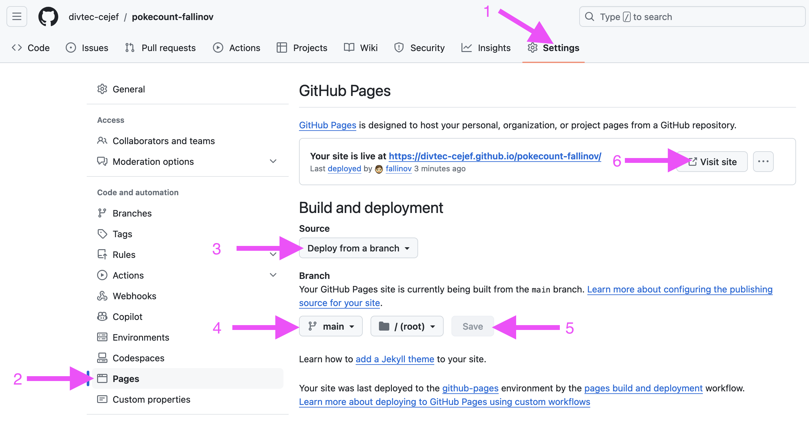

# 📅 3 septembre — Leçons 7 à 9

## 🚀 Objectifs du jour

* Revoir l'exercice PokeCount et présenter les travaux réalisés.
* Présenter et expliquer les challenges supplémentaires effectués par les apprentis.
* Démarrer l'exercice Mini Pokédex.

## 🔢 Revoir et Présenter l'exercice PokeCount


[exercice-pokecount.md](../exercices/exercice-pokecount.md)


* Présentation des projets PokeCount par les apprentis.
* Discussion sur les challenges supplémentaires réalisés (pagination, favoris, animations, etc.).
* Revue collective de certains extraits de code pour mettre en lumière les bonnes pratiques et les points d'amélioration.

### 📒 Démarrer l'exercice Mini Pokédex


[exercice-mini-pokedex.md](../exercices/exercice-mini-pokedex.md)


* Introduction à l'exercice Mini Pokédex : explication des objectifs de l'exercice.
* Lecture du code de départ, explication des parties principales.
* Début des premières étapes : affichage des Pokémons.
* **Partagez votre réalisation dès que l'étape 1 est terminée**
  *   Publiez votre application sur **GitHub Pages**

      * [Création d’un site GitHub Pages](https://docs.github.com/fr/pages/getting-started-with-github-pages/creating-a-github-pages-site) &#x20;

      <figure><figcaption></figcaption></figure>
  * **Partager le lien** avec le formateur par email.

## ✅ Devoirs

* Réaliser les étapes 1 à 4 de l'exercice Mini Pokédex.
