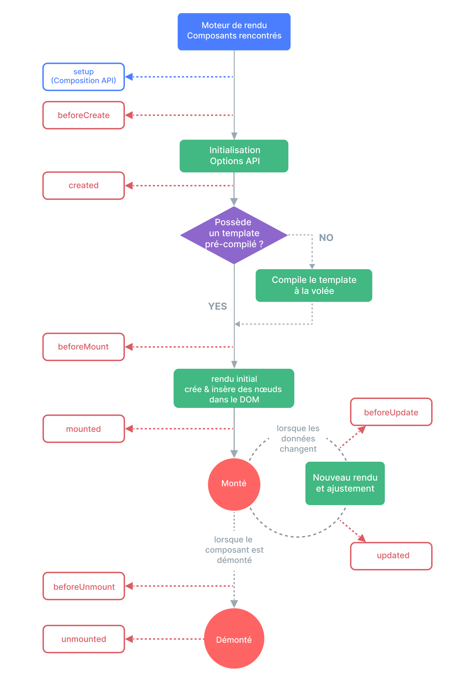

# Bases

## Données réactives / Data binding

### **Réactivité dans Vue.js**

La **réactivité** dans Vue.js permet à l'interface utilisateur de se mettre à jour automatiquement lorsque les données changent. C’est un concept clé qui garantit que toute modification de données est immédiatement reflétée dans le DOM, sans nécessiter d'interventions manuelles.

#### **Utilisation de `ref`**

`ref` est utilisé pour créer des données réactives simples, comme des variables primitives (chaînes de caractères, nombres, booléens) ou des objets. Lorsqu’on utilise `ref`, on doit accéder à la valeur réelle à l'aide de `.value`.

**Exemple :**

```javascript
import { ref } from 'vue';

const compteur = ref(0);
compteur.value += 1; // Accéder et modifier la valeur
```

#### **Utilisation de `reactive`**

`reactive` est utilisé pour créer des objets réactifs, des tableaux ou des structures de données plus complexes. Contrairement à `ref`, vous accédez directement aux propriétés sans avoir besoin de `.value`.

**Exemple :**

```javascript
import { reactive } from 'vue';

const utilisateur = reactive({
  nom: 'Alice',
  age: 25
});

utilisateur.age += 1; // Modification directe
```

#### **Différences Clés :**

* **`ref`** est idéal pour les valeurs primitives ou lorsque vous souhaitez créer un conteneur réactif.
* **`reactive`** convient mieux aux objets et aux tableaux, permettant des modifications directes.

La réactivité de Vue.js rend ainsi le développement web dynamique et fluide, en assurant des interfaces utilisateur toujours à jour.

### Démo


Tout ce que vous avez déclaré dans `<script setup>`\
sera automatiquement disponible dans `<template>`


```html
<script setup>
import { ref, reactive } from "vue";
// Donnée classique et donc PAS réactive
const CPT = 10;

// Donnée réactives primitive -> ref()
const anneeEnCours = ref(2023);

// Donnée réactives complexe -> reactive()
const personne = reactive({ nom: "Jean", anneeNaissance: 1992 });

// Fonction qui retourne l'age actuel
function getAge() {
  // Ne pas oublier le .value pour accéder la donnée de type ref()
  return anneeEnCours.value - personne.anneeNaissance;
}
</script>

<template>
  <p>
    Bonjour {{ personne.nom }} en {{ anneeEnCours }}
    tu auras {{ getAge() }} ans
  </p>
  <button @click="anneeEnCours -= CPT">Moins {{ CPT }} ans</button>
  -
  <button @click="anneeEnCours += CPT">Plus {{ CPT }} ans</button>
</template>
```



### [Méthodes](https://fr.vuejs.org/api/options-state.html#methods)

```html
<script setup>
import { ref } from "vue";
// Donnée réactives primitive -> ref()
const monAge = ref(33);

// Méthode anniversaire qui ajoute une année à monAge
function anniversaire() {
  // Ne pas oublier le .value pour accéder la donnée de type ref()
  monAge.value += 1;
}
</script>

<template>
  <p>Mon age: {{ monAge }} ans !</p>
  <p v-if="monAge >= 40">T'as pris un coup de vieux !</p>
  <button @click="anniversaire()">Joyeux anniversaire</button>
</template>
```

### [Utilisation, importation de composants](https://fr.vuejs.org/api/sfc-script-setup.html#using-components)

```html
<script setup>
// Importation d'un composant
// Charge le composant au démarrage de l'application
import MonComposant from "./components/MonComposant.vue"

// Importation asynchrone d'un composant
// Charge le composant au moment de son affichage et pas avant
import { defineAsyncComponent } from "vue"
const MonComposantAsync = defineAsyncComponent(() =>
  import("./components/MonComposantAsync.vue")
)
</script>

<template>
  <MonComposant />
  <MonComposantAsync />
</template>
```

### [Valeur calculée “Computed”](https://fr.vuejs.org/api/reactivity-core.html#computed)

```jsx
import { computed } from "vue"
const count = ref(0)

// Création d'une computed
const estVide = computed(() => {
  return count.value === 0 // Retourne true si count vaut 0
});
```

### [Observateur “Watcher”](https://vuejs.org/api/reactivity-core.html#watch)

```jsx
import { watch, ref } from "vue";
const counter = ref(0);

// Création d'un watcher
watch(counter, () => {
  console.log("Counter value changed");
});
```

### [Crochets du cyle de vie “Lifecycle Hooks”](https://fr.vuejs.org/api/composition-api-lifecycle.html)

```jsx
import { onMounted } from "vue";
console.log("Equivalent to created hook");

// Surcharge l'événement onMounted du cycle de vie
onMounted(() => {
  console.log("Mounted hook called");
});
```

<figure><figcaption></figcaption></figure>

### [Déclarer les événements émis par le composant](https://fr.vuejs.org/api/options-state.html#emits)

```jsx
// Déclaration des évéements du composant
const emit = defineEmits(["event-name"]);

// Fonction qui émet l'événement
function emitEvent() {
  emit("event-name");
}
```

### [Déclarer les propriétés “props” d’un composant](https://fr.vuejs.org/api/options-state.html#props)

```jsx

const props = defineProps({
  elements: Array, // Déclaration simple d'une props de type tableau
  counter: { // Déclaration avancée avec valeur par défaut pour la props
    type: Number,
    default: 0,
  },
	person: { // Déclaration avancée d'une props obligatoire
	    type: Object,
	    required: true
	  }
});

console.log(props.counter)
```
