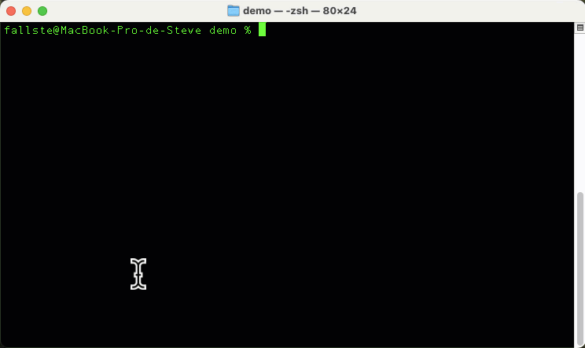
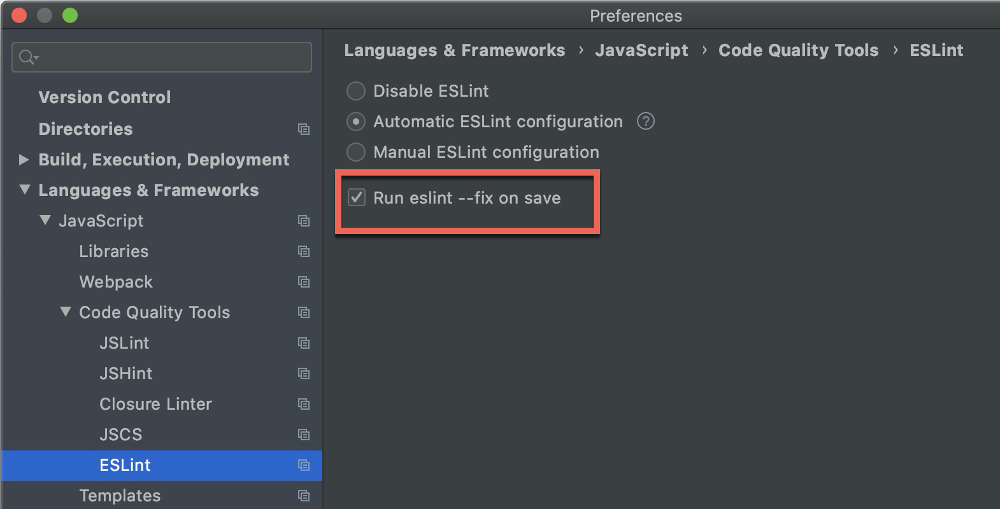

# Créer une application Vuetify

## Création d'un nouveau projet Vuetify

Pour créer un nouveau projet avec Vuetify suivez les étapes ci-dessous.

<div data-full-width="true">

<figure><figcaption><p>Création d'un nouveau projet Vuetify <code>hello-world</code></p></figcaption></figure>

</div>

### **Créer un projet Vuetify**

Dans votre terminal, exécutez la commande suivante pour créer un nouveau projet Vuetify.

```bash
npm create vuetify
```

Vous serez invité à répondre à quelques questions pour configurer le projet :

* **Project name**
  * Entrez le nom de votre projet, par exemple, `hello-world`.
  * Ce sera également le nom du dossier du projet
* **Which preset would you like to install?**&#x20;
  * Sélectionnez `Recommended`&#x20;
  * Utiliser les flèches clavier ↑ ↓ pour naviguer et Enter ↵ pour valider
* **Would you like to install dependencies with yarn, npm, pnpm, or bun?**&#x20;
  * Sélectionnez `npm`
  * Utiliser les flèches clavier ↑ ↓ pour naviguer et Enter ↵ pour valider
* **Use TypeScript?**&#x20;
  * Sélectionnez `No`&#x20;
  * Utiliser les flèches clavier ← → pour naviguer et Enter ↵ pour valider
* **Install Dependencies?**&#x20;
  * Sélectionnez `Yes`&#x20;
  * Utiliser les flèches clavier ← → pour naviguer et Enter ↵ pour valider

### **Accéder au répertoire de votre projet**

Une fois la création du projet terminée, accédez au répertoire de votre nouveau projet.

```bash
cd hello-world
```

### **Démarrer le serveur de développement**

Pour lancer votre projet en mode développement, exécutez la commande suivante.

```bash
npm run dev
```

Cette commande démarrera un serveur local. Vous verrez une sortie similaire dans votre terminal.

```
VITE v5.4.1  ready in 302 ms

➜  Local:   http://localhost:3000/
➜  Network: use --host to expose
➜  press h + enter to show help
```

### **Voir votre projet dans le navigateur**

* Ouvrez votre navigateur web préféré (Firefox 🦊, Chrome 💩,  Arc 🌈, etc.).
* Entrez l'URL `http://localhost:3000/` dans la barre d'adresse.
* Votre projet Vuetify sera visible et interactif dans le navigateur.

<figure><figcaption></figcaption></figure>

### **Arrêter le serveur de développement**&#x20;

* Utilisez le raccourci `CTRL+C` pour arrêter le serveur
* Où fermer le terminal

## Commandes de base utiles avec Vuetify

### **Générer un fichier de production — `npm run build`**

Lorsque vous êtes prêt à déployer votre application, vous devez générer un fichier de production optimisé :

```bash
npm run build
```

Cette commande compile votre projet et crée un dossier `dist/` contenant les fichiers optimisés pour la production.

### **Lancer un serveur de prévisualisation pour la production — `npm run preview`**

Après avoir généré les fichiers de production, vous pouvez les prévisualiser avec cette commande :

```bash
npm run preview
```

Cela lancera un serveur local pour voir à quoi ressemble votre application en production.

### **Installer une librairie** — `npm install`

```bash
npm install @vuetify/icons-material
```

Cela installe le package `@vuetify/icons-material` qui peut être utilisé dans votre projet.

### **Mise à jour des librairies — `npm update`**

```bash
npm update
```

Cela actualise tous les packages listés dans votre `package.json` vers leurs versions les plus récentes compatibles.

### **Lint et correction automatique du code — `npm run lint`**

#### **Qu'est-ce que le Lint ?**

Le Lint est un outil d'analyse statique de code qui identifie des erreurs de syntaxe, des bugs potentiels, des incohérences de style et d'autres problèmes dans votre code. Utiliser un linter permet d'améliorer la qualité et la lisibilité de votre code, tout en réduisant le nombre de bugs.

Vuetify utilise **ESLint** pour vérifier la qualité du code. Vous pouvez lancer ESLint pour vérifier votre code avec cette commande.

```bash
npm run lint
```

#### Correction automatique

Vous pouvez également corriger automatiquement les erreurs de linting en ajoutant `--fix` :

```bash
npm run lint --fix
```

Cette commande peut automatiquement corriger diverses erreurs de linting, notamment :

* Les problèmes de formatage (comme l'indentation incorrecte)
* Les espaces superflus ou manquants
* Les points-virgules oubliés
* Les guillemets simples ou doubles non conformes
* Les lignes de code trop longues
* Les accolades mal placées ou manquantes

Ces corrections automatiques permettent de maintenir la cohérence et la propreté du code, contribuant ainsi à un flux de travail plus efficace.

#### Configuration WebStorm


Vous pouvez configurer **WebStorm** pour qu'il lance la commande `--fix` dès que vous sauvegarder `CTRL+S` vos fichiers.


<figure><figcaption></figcaption></figure>

Ces commandes vous aideront à gérer efficacement votre projet Vuetify et à maintenir un flux de travail fluide tout au long du développement.

